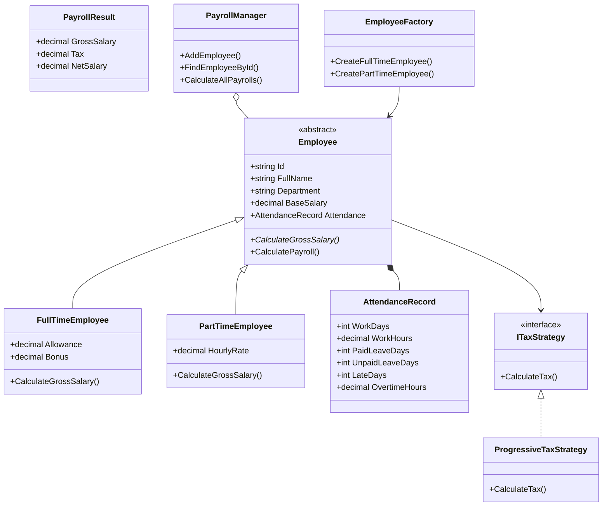

# Hệ thống chấm công và tính lương nhân viên

## 1. Giới thiệu đề tài

Đây là đồ án môn **Lập trình hướng đối tượng** với đề tài **Chấm công & Tính lương**. Chương trình mô phỏng hệ thống quản lý nhân viên, chấm công, tính lương, tính thuế thu nhập cá nhân và xuất bảng lương ra file.

Điểm nổi bật của bài là có áp dụng rõ ràng các đặc trưng OOP và Design Pattern:

- **Encapsulation**: đóng gói thông tin nhân viên, chấm công, bảng lương.
- **Abstraction**: lớp trừu tượng `Employee` định nghĩa khung chung cho mọi nhân viên.
- **Inheritance**: `FullTimeEmployee` và `PartTimeEmployee` kế thừa từ `Employee`.
- **Polymorphism**: mỗi loại nhân viên override hàm `CalculateGrossSalary()` theo công thức riêng.
- **Factory Method**: lớp `EmployeeFactory` chịu trách nhiệm tạo đối tượng nhân viên.
- **Strategy Pattern**: `ITaxStrategy` cho phép thay đổi cách tính thuế linh hoạt.
- **Singleton Pattern**: `PayrollManager` quản lý danh sách nhân viên duy nhất trong chương trình.

---

## 2. Công nghệ sử dụng

- Ngôn ngữ: **C#**
- Loại project: **Console App**
- Framework gợi ý: **.NET 6.0** hoặc mới hơn
- IDE: Visual Studio / Visual Studio Code

---

## 3. Chức năng chính

1. Thêm nhân viên Full-time
2. Thêm nhân viên Part-time
3. Hiển thị danh sách nhân viên
4. Cập nhật chấm công
5. Tính lương một nhân viên
6. Tính lương toàn bộ nhân viên
7. Xem thống kê bảng lương
8. Xuất bảng lương ra file `PayrollReport.txt`
9. Tìm kiếm nhân viên theo mã hoặc theo tên
10. Xóa nhân viên
11. Tạo dữ liệu mẫu để demo nhanh

---

## 4. Cấu trúc thư mục

```text
ChamCongTinhLuong_OOP/
├── Program.cs
├── ChamCongTinhLuong_OOP.csproj
├── Models/
│   ├── Employee.cs
│   ├── FullTimeEmployee.cs
│   ├── PartTimeEmployee.cs
│   ├── AttendanceRecord.cs
│   └── PayrollResult.cs
├── Patterns/
│   ├── EmployeeFactory.cs
│   ├── ITaxStrategy.cs
│   ├── ProgressiveTaxStrategy.cs
│   ├── FlatTaxStrategy.cs
│   ├── IReportExporter.cs
│   └── TextReportExporter.cs
├── Services/
│   ├── PayrollManager.cs
│   └── StatisticsService.cs
└── Utilities/
    ├── InputHelper.cs
    └── MoneyFormatter.cs
```

---

## 5. Sơ đồ lớp tóm tắt



---

## 6. Công thức tính lương

### Nhân viên Full-time

```text
Gross Salary = Lương cơ bản + Phụ cấp + Thưởng + Tiền tăng ca - Phạt đi trễ - Phạt nghỉ không phép
Net Salary   = Gross Salary - Thuế
```

### Nhân viên Part-time

```text
Gross Salary = Số giờ làm * Lương theo giờ + Giờ tăng ca * Lương giờ * 1.5 - Phạt đi trễ
Net Salary   = Gross Salary - Thuế
```

---

## 7. Cách chạy dự án

### Cách 1: Chạy bằng Visual Studio

1. Mở Visual Studio.
2. Chọn **Open a project or solution**.
3. Mở file `ChamCongTinhLuong_OOP.csproj`.
4. Nhấn **Ctrl + F5** để chạy.

### Cách 2: Chạy bằng terminal

Mở terminal trong thư mục dự án và chạy:

```bash
dotnet run
```

---

## 8. Gợi ý demo khi thuyết trình

1. Chọn chức năng `11` để tạo dữ liệu mẫu.
2. Chọn chức năng `3` để hiển thị danh sách nhân viên.
3. Chọn chức năng `4` để cập nhật chấm công cho một nhân viên.
4. Chọn chức năng `6` để tính lương toàn bộ nhân viên.
5. Chọn chức năng `7` để xem thống kê bảng lương.
6. Chọn chức năng `8` để xuất bảng lương ra file.

---

## 9. Nội dung nên nói khi báo cáo

Đề tài của nhóm em là hệ thống chấm công và tính lương nhân viên. Chương trình được xây dựng bằng C# Console App và áp dụng lập trình hướng đối tượng. Lớp `Employee` là lớp trừu tượng, đóng vai trò lớp cha cho hai lớp con `FullTimeEmployee` và `PartTimeEmployee`. Mỗi lớp con override phương thức `CalculateGrossSalary()` để thể hiện tính đa hình trong cách tính lương.

Ngoài OOP, chương trình còn sử dụng các Design Pattern như Factory Method để tạo nhân viên theo loại, Strategy Pattern để thay đổi cách tính thuế và Singleton Pattern để quản lý danh sách nhân viên tập trung. Chương trình có các chức năng như thêm nhân viên, chấm công, tính lương, thống kê và xuất bảng lương ra file TXT.
